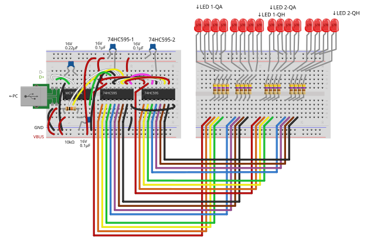

# MCP2221A + ShiftRegister
This example demonstrates how to control a 74HC595 shift register connected to an MCP2221A, using `Iot.Device.Multiplexing.ShiftRegister`.
This code sends 16-bit data to two cascaded 74HC595s to light up 16 LEDs.

## Wiring example

## Expected behavior

