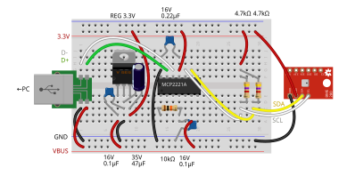

# `I2cDevice_BME280`
This example demonstrates how to use the `I2cDevice` implementation created from the MCP2221A to operate the BME280 atmospheric sensor binding provided by `Iot.Device.Bindings`.

## Wiring example

## Expected behavior

