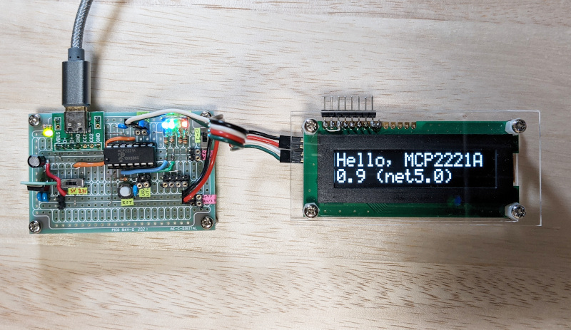

# `I2cDevice_US2066_SO1602A`
This example demonstrates how to use the `I2cDevice` implementation created from the MCP2221A to operate the SO1602A OLED character display binding provided by `Smdn.Devices.US2066`.

This example controls a [SO1602A OLED character display](https://akizukidenshi.com/catalog/g/gP-08277/) which has US2066 controller chip.

This example uses a package `Smdn.Devices.US2066` to control OLED display. For details about `Smdn.Devices.US2066`, see repository of [Smdn.Devices.US2066](https://github.com/smdn/Smdn.Devices.US2066/).

## Wiring example
See [this document](https://github.com/smdn/Smdn.Devices.US2066/tree/main/examples/MCP2221).

## Expected behavior

